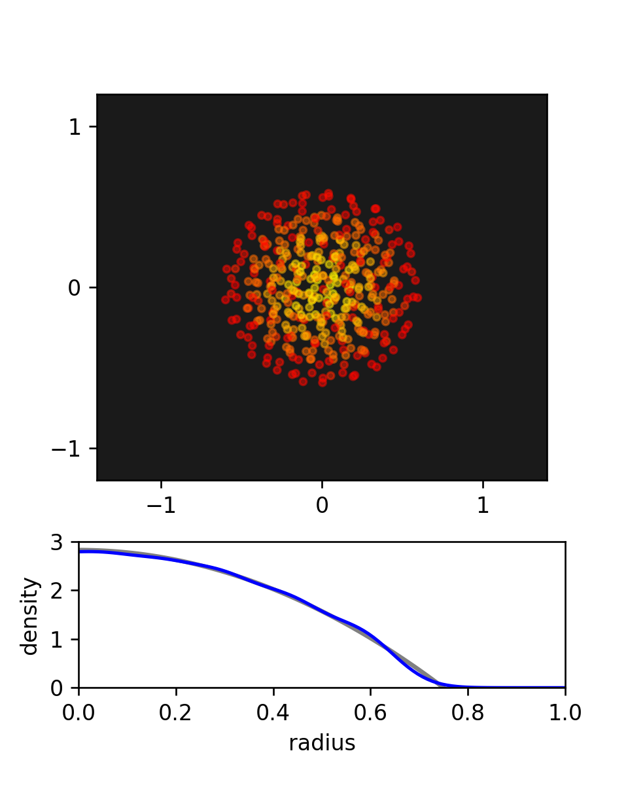

# sph-python
Smoothed-Particle Hydrodynamics simulation of Toy Star

## Create Your Own Smoothed-Particle Hydrodynamics Simulation (With Python)

### Philip Mocz (2020) Princeton Univeristy, [@PMocz](https://twitter.com/PMocz)

### [📝 Read the Algorithm Write-up on Medium](https://philip-mocz.medium.com/create-your-own-smoothed-particle-hydrodynamics-simulation-with-python-76e1cec505f1)

Simulate a toy star with SPH


```
python sph.py
```


